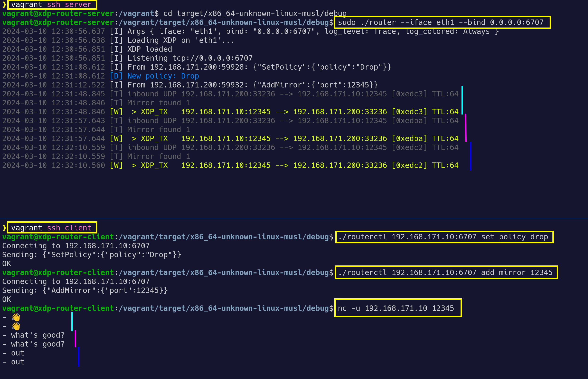

# XDP-Router

## Description

A **Rust** toy/demo project leveraging **eBPF XDP** for high-performance packet routing at the Linux kernel level, specifically at the earliest possible point in the network stack.

The project comprises three main components:
- **router_xdp**: The core program implementing UDP packet routing with eBPF XDP
- **router**: A server application that loads the eBPF XDP program into the kernel, manages XDP routing maps, and listens for TCP commands
- **routerctl**: A client for remotely managing the server over TCP (no TLS currently)


### UDP packet **mirroring/pong** demo:



Server (`192.168.171.10`):
  ```sh
  sudo router --iface eth1 --bind 0.0.0.0:6707
  ```

Client (`192.168.171.1`):
  ```sh
  routerctl 192.168.171.10:6707 set policy drop
  routerctl 192.168.171.10:6707 add mirror 12345
  nc -u 192.168.171.10 12345
  ```


### UDP packet **routing** demo:


Server (`192.168.171.10`):
  ```sh
  sudo router --iface eth1 --bind 0.0.0.0:6707
  ```

Client-1 (`192.168.171.1:1111`):
  ```sh
  routerctl 192.168.171.10:6707 set policy drop
  routerctl 192.168.171.10:6707 add route  192.168.171.1 1111 12345  192.168.171.1 2222 12345
  nc -u -p 1111 192.168.171.10 12345
  ```

Client-2 (`192.168.171.1:2222`):
  ```sh
  nc -u -p 2222 192.168.171.10 12345
  ```


## Build and Run locally

- Install:
  - nix: `nix-shell`
  - nix+direnv: `direnv allow .`
  - Debian / Ubuntu:
    - install rustup: `./asset/install_rustup.sh`
    - prepare rustup: `./asset/prepare_rustup.sh`
  - other:
    - install rustup: https://www.rust-lang.org/tools/install  
                      `curl --proto '=https' --tlsv1.2 -sSf https://sh.rustup.rs | sh`
    - prepare rustup: `./asset/prepare_rustup.sh`

- Build:
  ```bash
  ./build_debug.sh
  ```

- Run server, load XDP:
  ```bash
  ./run_router_local.sh
  ```

- Run client:
  ```bash
  ./run_routerctl_local_demo.sh
  ```


## Build and Run on Vagrant

- Start Debian 12 "Bookworm" VMs:
  ```sh
  vagrant up
  ```

- Build, run server, load XDP (on VM):
  ```sh
  vagrant ssh server --command "/vagrant/build_debug.sh"
  vagrant ssh server --command "/vagrant/run_router_vagrant.sh"
  ```

- Run client (optionaly on VM):
  ```sh
  vagrant ssh client --command "/vagrant/run_routerctl_vagrant_demo.sh"
  # or just: ./run_routerctl_vagrant_demo.sh
  ```


## Troubleshooting

Check if XDP was loaded:

  ```sh
  vagrant ssh server
  sudo xdp-loader status | grep router_xdp
  sudo bpftool prog show | grep router_xdp
  ```

Test mirroring/pong with debug port:
  ```sh
  # XDP loaded locally
  nc -u 127.0.0.1 65500

  # XDP loaded on vagrant
  nc -u 192.168.171.10 65500
  ```
