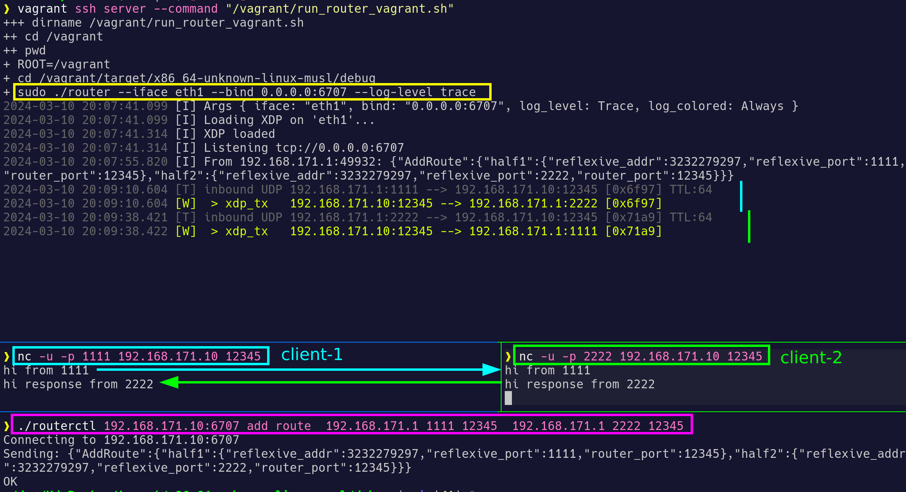

# XDP UDP Routing

UDP packet routing by **XDP** controlled via API.

## Build:

[Requirements](../#Requirements)

```sh
cargo build --release --target=x86_64-unknown-linux-musl
```


## Demo-1: UDP packet **mirroring/pong**


```sh
# Server with XDP (vagrant `192.168.171.10`):
vagrant up
vagrant ssh server -c "sudo /app/poc --iface eth1 --bind 0.0.0.0:6707"

# Client (vagrant `192.168.171.1`):
vagrant ssh client -c "curl http://192.168.171.10:6707/policy/drop"
vagrant ssh client -c "curl http://192.168.171.10:6707/mirror/add/12345"
vagrant ssh client -c "nc -u 192.168.171.10 12345"
```


## Demo-2: UDP packet **routing**



```sh
# Server with XDP (vagrant `192.168.171.10`):
vagrant up
vagrant ssh server -c "sudo /app/poc --iface eth1 --bind 0.0.0.0:6707"

# Client-1 (vagrant `192.168.171.1:1111`):
vagrant ssh client -c "curl http://192.168.171.10:6707/policy/drop"
vagrant ssh client -c "curl http://192.168.171.10:6707/route/add/192.168.171.1:1111/12345/192.168.171.1:2222/12345"
vagrant ssh client -c "nc -u -p 1111 192.168.171.10 12345"

# Client-2 (vagrant `192.168.171.1:2222`):
vagrant ssh client -c "nc -u -p 2222 192.168.171.10 12345"
```


## Troubleshooting

```sh
# Check if XDP was loaded:
sudo xdp-loader status | grep poc
sudo bpftool prog show | grep poc

# Test mirroring/pong to debug port:
nc -u 127.0.0.1 65500 # if XDP loaded locally
nc -u 192.168.171.10 65500 # if XDP loaded on vagrant VM
vagrant ssh client -c "nc -u 192.168.171.10 65500" # debug port
```
